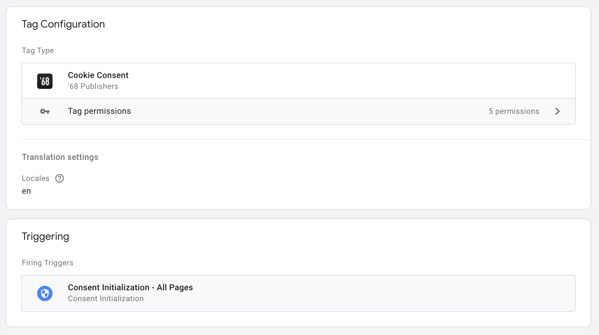
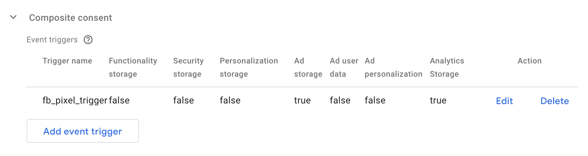

<div align="center" style="text-align: center; margin-bottom: 50px">

<h1 align="center">Cookie Consent</h1>

An extended integration of [orestbida/cookieconsent](https://github.com/orestbida/cookieconsent) with support of the Google Tag Manager.
</div>

<br>

- :white_check_mark: Easy configurable GTM template
- :white_check_mark: Configurable storages standardized by Google
- :white_check_mark: Possibility to synchronize consents between more storages
- :white_check_mark: Default translations

## Table of contents

* [Integration into the GTM](#integration-into-the-gtm)
* [Configuration](#configuration)
* [Settings modal trigger](#settings-modal-trigger)
* [Triggering tags based on the consent](#triggering-tags-based-on-the-consent)
* [Accessing the wrapper in the JavaScript](#accessing-the-wrapper-in-the-javascript)
* [Integration with CMP application](#integration-with-cmp-application)
* [How the GTM integration works](#how-the-gtm-integration-works)
* [How to update already published container](#how-to-update-already-published-containers)
  * [Migration from v0.4 to v0.5](#migration-from-v04-to-v05)
* [Development](#development)
* [License](#license)

## Integration into the GTM

Open Google Tag Manager [web administration](https://tagmanager.google.com) and select a container for your website.
Next, go through the `Templates` link in the left navigation and click on the button `New` inside a section `Tag Templates`.

All you need is a file [`gtm_template.tpl`](/gtm_template.tpl) from the root directory of this package. Download the file and import it in the Template editor:


After successful import click on the button `Save`, leave the Template editor, and go through the `Tags` link in the left navigation.
Then create the new tag with the imported Template, as trigger set an option `Consent Initialization - All Pages` and save it.



Now you can open a preview of the website and as you can see the cookie widget is here! But let's configure it a bit.

## Configuration

> :exclamation: Locking the package version is highly recommended (see the field `Package version` below) after you successfully configure the template. Avoid using the `latest` version in production containers!

The plugin is configurable using fields inside the tag definition.

### Basic options

| Field                               | Description                                                                                                                                                                                                                                                  |
|-------------------------------------|--------------------------------------------------------------------------------------------------------------------------------------------------------------------------------------------------------------------------------------------------------------|
| Package version                     | Version of the package `68publishers/cookie-consent`. Valid inputs are the `latest` or a version in formats `x.x.x`, `x.x.x-beta.x` and `x.x.x-alpha-x`. For available versions see the [releases](https://github.com/68publishers/cookie-consent/releases). |
| Make consent required               | The page will be blocked until a user action.                                                                                                                                                                                                                |
| Show the widget as soon as possible | The widget will be displayed automatically on the page load. You must trigger the widget manually by calling `CookieConsentWrapper.unwrap().show()` if the option is disabled.                                                                               |
| Init widget after DOMContentLoaded  | The widget is initialized as soon as possible by default. If the option is enabled, initialization will wait until the `DOMContentLoaded` event.                                                                                                             |
| Hide from bots                      | Enable if you don't want the plugin to run when a bot/crawler/webdriver is detected.                                                                                                                                                                         |
| Revision                            | Revision number of your terms of use of cookies. For more information [see below](#how-to-manage-revisions).                                                                                                                                                 |
| Delay                               | Number of milliseconds before showing the consent modal.                                                                                                                                                                                                     |

### Consent & Setting modal options

Both sections contain these fields: `Layout`, `Position`, `Transition`. These settings affect where modals appear and what shape they take.
The behavior of the consent modal buttons can be configured through fields `Primary button role`, `Secondary button role` (accept necessary cookies or open the settings modal), and `Buttons order`.
See the [widget documentation](https://github.com/orestbida/cookieconsent/tree/v2.8.3#layout-options--customization) for more details.

The consent modal has also an option `Show third button` that adds the third button to the modal. If the secondary button's role is `Open settings` the third button's role is `Accept necessary` and vice versa.

The settings modal has one special option with the name `Settings modal trigger selector`. A value of the option can be CSS selector for automatic creation of the trigger button that opens the modal. Check the [example](#settings-modal-trigger).

### Cookies options

| Field                       | Description                                                                                                                                                                                                            |
|-----------------------------|------------------------------------------------------------------------------------------------------------------------------------------------------------------------------------------------------------------------|
| Cookie name                 | The name of a cookie value that holds information about the user's consent.                                                                                                                                            |
| Cookie domain               | The domain name for the cookie that holds information about the user's consent, for example ".example.com". If the value is empty, it is automatically set in a browser using the "window.location.hostname" variable. |
| Cookie expiration           | Expiration of the cookie in days.                                                                                                                                                                                      |
| Enable cookies auto-clear   | All cookies will be deleted based on the user's consent and a selected strategy if the option is enabled.                                                                                                              |
| Cookies auto-clear strategy | Strategy for cookies auto-clear feature.                                                                                                                                                                               |
| Cookie names                | Names of the cookies that will be deleted or kept (based on a selected strategy).                                                                                                                                      |

The following strategies are implemented:

1) `Clear all except defined`<sup>*</sup> - All cookies except those you define in the field `Cookie names` will be deleted when the user denies any storage.
2) `Clear defined only`<sup>*</sup> - All cookies you defined in the field `Cookie names` will be deleted when the user denies any storage.
3) `Use cookie tables` - Cookie clearing is based on cookie tables from the original [plugin](https://github.com/orestbida/cookieconsent). Integration of [CMP application](#integration-with-cmp-application) is required for this option.

<sup>*</sup> There is no need to define a name from the `Cookie name` field because this cookie is never automatically deleted.

### Storage options

The following types of storage are available:

- Functionality storage
- Security storage
- Personalization storage
- Ad storage
- Ad user data
- Ad personalization
- Analytics storage

Each storage defines the name of a trigger that will be invoked if the user provides consent. It is not necessary to use or display each storage in the widget. Also, the consent for the storage can be synchronized with the consent of another storage.

| Field                                                        | Description                                                                                                                                                                                                                                        |
|--------------------------------------------------------------|----------------------------------------------------------------------------------------------------------------------------------------------------------------------------------------------------------------------------------------------------|
| Visibility and default state                                 | Defines whether the storage should be visible in the widget and what its default value is.                                                                                                                                                         |
| &nbsp;&nbsp;&nbsp;- Visible, Enabled by default              | Storage is visible in the widget and is enabled by default.                                                                                                                                                                                        |
| &nbsp;&nbsp;&nbsp;- Visible & Readonly, Enabled by default   | Storage is visible in the widget, it is always enabled and cannot be disabled (usually used for `Functionality storage`).                                                                                                                          |
| &nbsp;&nbsp;&nbsp;- Visible, Disabled by default             | Storage is visible in the widget and is disabled by default.                                                                                                                                                                                       |
| &nbsp;&nbsp;&nbsp;- Hidden, Synchronized                     | Storage is not visible in the widget and the consent is synchronized with another storage.                                                                                                                                                         |
| &nbsp;&nbsp;&nbsp;- Hidden, Disabled always                  | Storage is not visible in the widget and is always disabled. Use for storages that are not used by the application at all.                                                                                                                         |
| Synchronize consent with                                     | The consent can be synchronized with another storage. The option is available only if the option `Visibility and default state` is set to `Hidden, Synchronized`.                                                                                  |
| If the storage is denied show the modal again after `x` days | The settings modal will be opened again after the specified number of days if the storage is denied. The option is available only if the option `Display in the widget` is set to `Visible, Enabled by default` or `Visible, Disabled by default`. |
| Event trigger name                                           | The name of an event trigger that will be invoked on `granted` consent with storage. The name may not be unique for each storage (unique triggers are invoked only). No trigger is invoked if the option has an empty value.                       |

### Event triggers based on composite consent

As mentioned above, each storage can define a trigger that is invoked when consent with the storage has been granted.
In some situations, you may want some trigger to be fired only if the user gives consent with multiple storage types.
For example, if you have a trigger called `fb_pixel_trigger` and you want to fire it only if the user gives consent with the `analytics_storage` and the `ad_stroage`.
Then your configuration may look like this:



### Translation settings

The package comes with the default translations for the following languages:

- [English - en](src/resources/translations/en.json)
- [Czech - cs](src/resources/translations/cs.json)
- [Slovak - sk](src/resources/translations/sk.json)
- [Spanish - es](src/resources/translations/es.json)
- [French - fr](src/resources/translations/fr.json)
- [German - de](src/resources/translations/de.json)
- [Bulgarian - bg](src/resources/translations/bg.json)
- [Hungarian - hu](src/resources/translations/hu.json)
- [Polish - pl](src/resources/translations/pl.json)
- [Romanian - ro](src/resources/translations/ro.json)
- [Slovenian - sl](src/resources/translations/sl.json)
- [Finnish - fi](src/resources/translations/fi.json)
- [Dutch - nl](src/resources/translations/nl.json)
- [Croatian - hr](src/resources/translations/hr.json)
- [Italian - it](src/resources/translations/it.json)
- [Norwegian - no](src/resources/translations/no.json)
- [Swedish - sv](src/resources/translations/se.json)
- [Ukrainian - uk](src/resources/translations/ua.json)
- [Portuguese - pt](src/resources/translations/pt.json)

Translations that will be loaded and accessible for the widget are taken from the field `Locales`. Each locale must be defined on a new line.
Alternatively, from version `1.0.0`, the URL from which the translations are to be downloaded can also be entered.


In the example above, the default translations for the English language are downloaded and the translations for the German language are downloaded from the URL `https://www.example.com/public/cc-translations/de.json`.
A translation file must always be in JSON format and its name must match a locale.

If you want to rewrite default translations, or you want to add translations for a new locale then you can define them in a table `Translations`.

### Locale detection

Locale detection can be affected with the following fields:

| Field                     | Description                                                                                                                                                  |
|---------------------------|--------------------------------------------------------------------------------------------------------------------------------------------------------------|
| Locale detection strategy | `Browser` to get user's browser language or `Document` to read a value from `<html lang="...">` of the current page.                                         |
| Locale                    | You must define the website locale when the detection strategy is disabled. The locale must be one of the previously defined locales in the field `Locales`. |

### How to manage revisions

The default revision number is `0` and the number can be changed through the field `Revision`. When you change the value the consent modal will be displayed for all users again.
You can define a message that will be displayed in the consent modal's description. If you want to do that define custom translation with the key `consent_modal_revision_message` and rewrite a translation with the key `consent_modal_description`. The plugin will replace the placeholder `[[revision_message]]` in the consent modal description with your revision message.


*<sup>Note: the <a href="https://github.com/orestbida/cookieconsent/tree/v2.8.3#how-to-enablemanage-revisions">cookieconsent plugin</a> uses the placeholder `{{revision_message}}` but this notation is used by GTM for variables so the package comes with the placeholder `[[revision_message]]` instead.</sup>*

### Stylesheets

| Field                       | Description                                                                                                                                                                                  |
|-----------------------------|----------------------------------------------------------------------------------------------------------------------------------------------------------------------------------------------|
| Include default stylesheets | The default stylesheet for the widget will be loaded into the page if the option is checked. We recommend keeping the option checked and adding custom stylesheets through the next options. |
| External stylesheets        | The list of custom CSS stylesheets. One URL per line.                                                                                                                                        |
| Internal stylesheet         | Custom CSS rules that will be injected into the page after default stylesheets and other external stylesheets.                                                                               |

### Page scripts

| Field               | Description                                                          |
|---------------------|----------------------------------------------------------------------|
| Manage page scripts | Enable if you want to easily manage existing `<script>` tags.        |
| Script selector     | The name of a data attribute that is used for managed <script> tags. |

Managing page scripts is disabled by default. When the feature is enabled then the following notation can be used for scripts you want to manage:

```html
<script type="text/plain" data-cookiecategory="analytics_storage" src="analytics.js" defer></script>

<script type="text/plain" data-cookiecategory="ad_storage" defer>
    console.log('Ad storage enabled!');
</script>
```

## Settings modal trigger

When the user dismisses the consent modal then the modal is not displayed until the consent cookie expires. But you want to give the ability to change preferences later.
This can be done automatically with the configuration field `Settings modal trigger selector`. For example, if you have this HTML code on your website:

```html
<footer>
    <div class="footer-container">
        <div class="footer-item">
            <a href="/terms-of-use">
                <span class="footer-item-text">Terms of use</span>
            </a>
        </div>
        <div class="footer-item">
            <a href="/faq">FAQ</a>
        </div>
        <div class="footer-item">
            <a href="/contact">
                <span class="footer-item-text">Contact</span>
            </a>
        </div>
    </div>
</footer>
```

And the field `Settings modal trigger selector` is configured like this:


Then the plugin injects a new item into the footer automatically:

```html
<footer>
    <div class="footer-container">
        <div class="footer-item">
            <a href="/terms-of-use">
                <span class="footer-item-text">Terms of use</span>
            </a>
        </div>
        <div class="footer-item">
            <a href="/faq">FAQ</a>
        </div>
        <div class="footer-item">
            <a href="/contact">
                <span class="footer-item-text">Contact</span>
            </a>
        </div>
        <div class="footer-item">
            <a href="#cookie-settings" data-cc="c-settings">
                <span class="footer-item-text">Cookie settings</span>
            </a>
        </div>
    </div>
</footer>
```

However, it is not always possible to achieve the right result with this automation (depending on the website layout). In this case, leave the `Settings modal trigger selector` field blank and define the link in your layout manually.
Opening of the settings modal will be triggered automatically to the link.

## Triggering tags based on the consent

Tags are triggered after the consent with event triggers that are defined for each [storage](#storage-options). For example, if you have the `analytics_storage` configured like this:


Then create a custom trigger with the following options:


And a tag that is fired with the trigger:


## Accessing the wrapper in the JavaScript

The wrapper is accessible in the `window` under the name `CookieConsentWrapper`. The recommended way how to manipulate with it is through event callbacks because the wrapper may not be fully initialized at the time your script is executed.
Callbacks are attached with calling of the method `CookieConsentWrapper.on()`, however since the version `1.0.0` the preferred method is to use the `window.cookieConsentWrapperEvents` variable.

The use of the variable avoids the situation when the wrapper does not exist in the window yet.

### Init event

A callback is invoked when the wrapper is fully initialized or directly if everything has been already initialized.

```html
<script>
    window.cookieConsentWrapperEvents = window.cookieConsentWrapperEvents || [];

    window.cookieConsentWrapperEvents.push(['init', function () {
        if (CookieConsentWrapper.allowedCategory('analytics_storage')) {
            // check if the analytics_storage is granted
        }

        CookieConsentWrapper.unwrap(); // get the original cookie consent plugin
    }]);
</script>
```

### Consent events

```html
<script>
    window.cookieConsentWrapperEvents = window.cookieConsentWrapperEvents || [];

    window.cookieConsentWrapperEvents.push(['consent:first-action', function (consent) {
        // called on the first user's action
    }]);

    window.cookieConsentWrapperEvents.push(['consent:accepted', function (consent) {
        // called on every page load after the first user's action
    }]);

    window.cookieConsentWrapperEvents.push(['consent:changed', function (consent, changedCategories) {
        // called when preferences changed
    }]);
</script>
```

### Locale event

```html
<script>
    window.cookieConsentWrapperEvents = window.cookieConsentWrapperEvents || [];

    window.cookieConsentWrapperEvents.push(['locale:change', function (locale) {
        // called when the plugin locale is changed through method `CookieConsentWrapper.changeLocale()`
        console.log(locale + '!');
    }]);

    // ...

    CookieConsentWrapper.changeLocale('cs', true) // cs!
    CookieConsentWrapper.changeLocale('en', true) // en!
</script>
```

## Integration with CMP application

The widget can be integrated with [the CMP application](https://github.com/68publishers/consent-management-platform).

The first thing to do is to set up the user information under the `Integration` section. Each user must have an identity (ID).
The default option is `Generated UUID`, however you can set a custom GTM variable that will return the ID of the current user of your website.

The ID will be accessible in all your translations with placeholder `[[user_identity]]`.

You can also set other attributes that will be sent to the CMP application along with the consents.


Configuration of the CMP application is easy, just set the URL of your application and the project code (if you leave it blank, the site domain is used as the code).


The configuration includes two options

- Consent API enabled
- Cookies API enabled

If you check the `Consent API enabled` option, the widget will automatically send consents to the CMP application.

If you check the `Cookies API enabled` option then the widget will automatically pull all cookies from the CMP application for the project and creates cookie tables from them.
Below this field you can define which columns the cookie table should contain.


## How the GTM integration works

#### Consent initialization

- :fire: A tag that is associated with the [Cookie Consent Template](/gtm_template.tpl) is fired
    - :gear: A configuration for `CookieConsentWrapper` object is created from values defined inside the tag
    - :ballot_box_with_check: The default consent is resolved according to the configuration and already existent user preferences
    - :arrows_counterclockwise: The default consent is sent into [native Google Consent API](https://developers.google.com/tag-platform/devguides/consent#gtag.js)
    - :hourglass_flowing_sand: Custom [triggers](#triggering-tags-based-on-the-consent) for granted storage types are scheduled into a `gtag` function
    - :arrow_double_down: A script with the wrapper initialization is injected into a page

#### GTM Container loaded

- :fire: Custom triggers for granted storage types are fired

#### Page loaded

- :fast_forward: The `CookieConsentWrapper` object is fully initialized
    - :fast_forward: The [original plugin](https://github.com/orestbida/cookieconsent) is initialized
    - :fire: Callbacks for an [event](#init-event) `CookieConsentWrapper.on('init')` are fired
    - :eye: The consent modal is shown if a user has not yet agreed to the use of cookies
        - :fire: After user's action, callbacks for an [event](#consent-events) `CookieConsentWrapper.on('consent:first-action')` are fired
        - :arrows_counterclockwise: The consent is sent into the CMP application
    - :fire: Callbacks for an [event](#consent-events) `CookieConsentWrapper.on('consent:accepted')` are fired

#### User updates his preferences through the setting modal

- :arrows_counterclockwise: The consent update is sent into [native Google Consent API](https://developers.google.com/tag-platform/devguides/consent#gtag.js)
- :fire: Custom triggers for newly granted storage types are fired
- :fire: Callbacks for an [event](#consent-events) `CookieConsentWrapper.on('consent:changed')` are fired
- :arrows_counterclockwise: The consent is sent into the CMP application

## How to update already published containers

If you want to update to the newer version please firstly look into [releases](https://github.com/68publishers/cookie-consent/releases) to see what has changed until the release that you using.

For update, you must reimport the Template in your GTM in the same way how you imported it for the first time. The template will be updated but existing configurations inside tags will be kept. Of course, if the Template wasn't changed between releases then you can skip this step.

Then open the associated tag and update the value of the field `Package version`.

### Migration from v0.4 to v0.5

For more detailed information on migrating from `0.4.x` to `0.5.x`, please continue to the page [Migration from v0.4 to v0.5](docs/migration-from-0.4-to-0.5.md).

## Development

Firstly download the package and install dependencies:

```sh
$ git clone https://github.com/68publishers/cookie-consent.git
$ cd cookie-consent
$ npm install
```

Use predefined commands for the package build:

```sh
$ npm run build:dev # or prod
```

Paths of output files are:
 - `~/demo/cookie-consent.js` (dev mode)
 - `~/dist/cookie-consent.min.js` (production mode)

A simple demo page without real GTM is located in `~/demo/index.html`. To show the demo in your browser run:

```sh
$ npm run start:dev
```

Then visit the page `http://localhost:3000`.

## License

The package is distributed under the MIT License. See [LICENSE](LICENSE.md) for more information.
