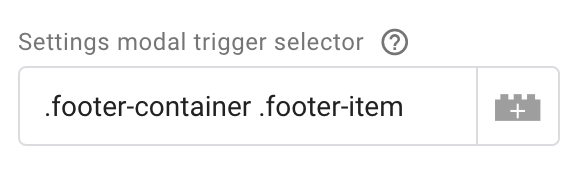
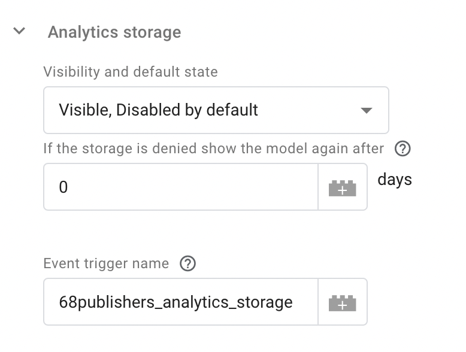

<div align="center" style="text-align: center; margin-bottom: 50px">

<h1 align="center">Cookie Consent</h1>

An extended integration of [orestbida/cookieconsent](https://github.com/orestbida/cookieconsent) with support of the Google Tag Manager. 
</div>

## Table of contents

* [Integration into the GTM](#integration-into-the-gtm)
* [Configuration](#configuration)
* [Settings modal trigger](#settings-modal-trigger)
* [Triggering tags based on the consent](#triggering-tags-based-on-the-consent)
* [Development](#development)
* [License](#license)

## Integration into the GTM

Open Google Tag Manager [web administration](https://tagmanager.google.com) and select a container for your website.
Next, go through the `Templates` link in the left navigation and click on the button `New` inside a section `Tag Templates`.

All you need is a file [`gtm_template.tpl`](/gtm_template.tpl) from the root directory of this package. Download the file and import it in the Template editor:


After successful import click on the button `Save`, leave the Template editor, and go through the `Tags` link in the left navigation.
Then create the new tag with the imported Template, as trigger set an option `Consent Initialization - All Pages` and save it.


Now you can open a preview of the website and as you can see the cookie widget is here! But let's configure it a bit.

## Configuration

The plugin is configurable using fields inside the tag definition.

### Basic options

| Field | Description |
| ------ | ------ |
| Package version  | Version of the package `68publishers/cookie-consent`. Valid inputs are the `latest` or a version in format `x.x.x`. For available versions see the [releases](https://github.com/68publishers/cookie-consent/releases). |
| Make consent required | The page will be blocked until a user action. |
| Show the widget as soon as possible | The widget will be displayed automatically on the page load. You must trigger the widget manually by calling `CookieConsentWrapper.unwrap().show()` if the option is disabled. |
| Hide from bots | Enable if you don't want the plugin to run when a bot/crawler/webdriver is detected. |
| Cookie name | The name of the cookie that contains the user's consent. |
| Cookie expiration | Expiration of the cookie in days. |
| Revision | Revision number of your terms of use of cookies. For more information [see below](#how-to-manage-revisions). |
| Delay | Number of milliseconds before showing the consent modal. |
| Settings modal trigger selector | CSS selector for automatic creation of the trigger button that opens the settings modal. Check the [example](#settings-modal-trigger). |

### Consent & Setting modal options

Both sections contain these fields: `Layout`, `Position`, `Transition`. These settings affect where modals appear and what shape they take.
The behavior of the consent modal buttons can be configured through fields `Primary button role`, `Secondary button role` (accept necessary cookies or open the settings modal), and `Buttons order`.

See the [widget documentation](https://github.com/orestbida/cookieconsent/tree/v2.7.1#layout-options--customization) for more details.

### Storage options

Five types of storage are available:

- Functionality storage
- Security storage
- Personalization storage
- Ad storage
- Analytics storage

Each storage defines the name of a trigger that will be invoked if the user provides consent. It is not necessary to use or display each storage in the widget. Also, the consent for the storage can be synchronized with the consent of another storage.

| Field | Description |
| ------ | ------ |
| Enabled by default | A storage has `granted` consent by default if the option is checked. Triggers will be invoked as soon as possible. |
| Display in the widget | A storage will be displayed inside the settings modal if the option is checked. |
| Readonly | A toggle button for storage inside the settings modal will be disabled if the option is checked. Commonly used for functionality storage. The option is available only if the option `Display in the widget` is checked. |
| Synchronize consent with | The consent can be synchronized with another storage. The option is available only if the option `Display in the widget` is not checked. |
| Event trigger name | The name of an event trigger that will be invoked on `granted` consent with storage. The name may not be unique for each storage (unique triggers are invoked only). No trigger is invoked if the option has an empty value. |

### Translation settings

The package comes with the default translations for the following languages:

- [en](src/resources/translations/en.json)
- [cs](src/resources/translations/cs.json)

Translations that will be loaded and accessible for the widget are taken from the field `Locales`. Locale codes are in the format `ISO 639-1` and each locale must be defined on a new line.
If you want to rewrite default translations or you want to add translations for a new locale then you can define them in a table `Translations`.

### Locale detection

Locale detection can be affected with the following fields:

| Field | Description |
| ------ | ------ |
| Locale detection strategy | `Browser` to get user's browser language or `Document` to read a value from `<html lang="...">` of the current page. |
| Locale | You must define the website locale when the detection strategy is disabled. The locale must be one of the previously defined locales in the field `Locales`. |

### How to manage revisions

The default revision number is `0` and the number can be changed through the field `Revision`. When you change the value the consent modal will be displayed for all users again.
You can define a message that will be displayed in the consent modal's description. If you want to do that define custom translation with the key `consent_modal_revision_message` and rewrite a translation with the key `consent_modal_description`. The plugin will replace the placeholder `[[revision_message]]` in the consent modal description with your revision message.


*<sup>Note: the <a href="https://github.com/orestbida/cookieconsent/tree/v2.7.1#how-to-enablemanage-revisions">cookieconsent plugin</a> uses the placeholder `{{revision_message}}` but this notation is used by GTM for variables so the package comes with the placeholder `[[revision_message]]` instead.</sup>*

### Stylesheets

| Field | Description |
| ------ | ------ |
| Include default stylesheets | The default stylesheet for the widget will be loaded into the page if the option is checked. We recommend keeping the option checked and adding custom stylesheets through the next options. |
| External stylesheets | The list of custom CSS stylesheets. One URL per line. |
| Internal stylesheet | Custom CSS rules that will be injected into the page after default stylesheets and other external stylesheets. |

### Page scripts

| Field | Description |
| ------ | ------ |
| Manage page scripts | Enable if you want to easily manage existing `<script>` tags. |
| Script selector | The name of a data attribute that is used for managed <script> tags. |

Managing page scripts is disabled by default. When the feature is enabled then the following notation can be used for scripts you want to manage:

```html
<script type="text/plain" data-cookiecategory="analytics_storage" src="analytics.js" defer></script>

<script type="text/plain" data-cookiecategory="ad_storage" defer>
    console.log('Ad storage enabled!');
</script>
```

## Settings modal trigger

When the user dismisses the consent modal then the modal is not displayed until the consent cookie expires. But you want to give the ability to change preferences later.
This can be done automatically with the configuration field `Settings modal trigger selector`. For example, if you have this HTML code on your website:

```html
<footer>
    <div class="footer-container">
        <div class="footer-item">
            <a href="/terms-of-use">
                <span class="footer-item-text">Terms of use</span>
            </a>
        </div>
        <div class="footer-item">
            <a href="/faq">FAQ</a>
        </div>
        <div class="footer-item">
            <a href="/contact">
                <span class="footer-item-text">Contact</span>
            </a>
        </div>
    </div>
</footer>
```

And the field `Settings modal trigger selector` is configured like this:



Then the plugin injects a new item into the footer automatically:

```html
<footer>
    <div class="footer-container">
        <div class="footer-item">
            <a href="/terms-of-use">
                <span class="footer-item-text">Terms of use</span>
            </a>
        </div>
        <div class="footer-item">
            <a href="/faq">FAQ</a>
        </div>
        <div class="footer-item">
            <a href="/contact">
                <span class="footer-item-text">Contact</span>
            </a>
        </div>
        <div class="footer-item">
            <a href="#cookie-settings" data-cc="c-settings">
                <span class="footer-item-text">Cookie settings</span>
            </a>
        </div>
    </div>
</footer>
```

However, it is not always possible to achieve the right result with this automation (depending on the website layout). In this case, leave the `Settings modal trigger selector` field blank and define the link in your layout manually.
Opening of the settings modal will be triggered automatically to the link.

## Triggering tags based on the consent

Tags are triggered after the consent with event triggers that are defined for each [storage](#storage-options). For example, if you have the `analytics_storage` configured like this:



Then create a custom trigger with the following options:


And a tag that is fired with the trigger:


## Development

Firstly download the package:

```sh
$ git clone https://github.com/68publishers/cookie-consent.git
$ cd cookie-consent
```

Use predefined commands for the package build:

```sh
$ npm run build:dev # or prod
```

Paths of output files are:
 - `~/build/cookie-consent.js` (dev mode)
 - `~/dist/cookie-consent.min.js` (production mode)

A simple demo page without real GTM is located in `~/build/index.html`. To show the demo in your browser run:

```sh
$ npm run start:dev
```

Then visit the page `http://localhost:3000`.

## License

The package is distributed under the MIT License. See [LICENSE](LICENSE.md) for more information.
