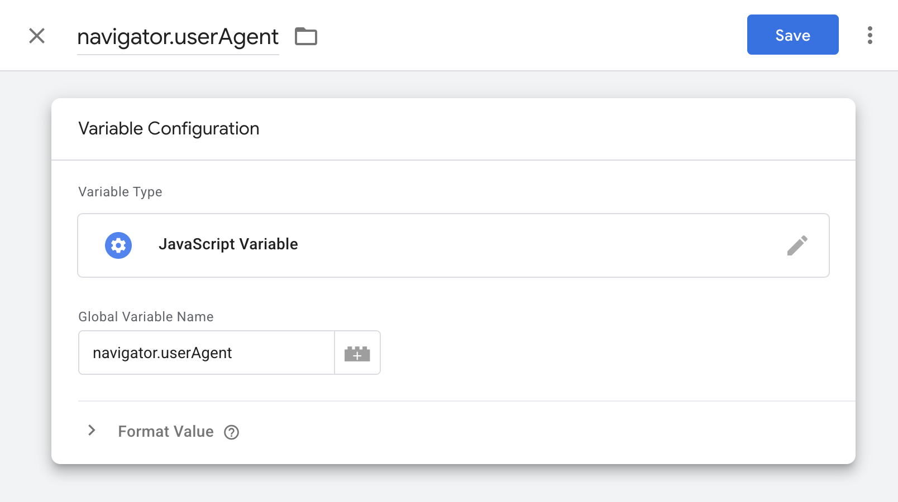
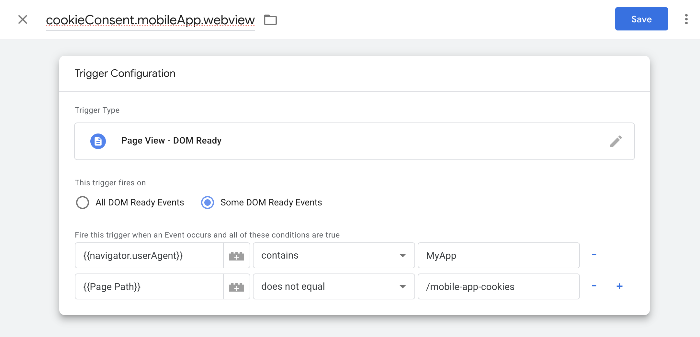
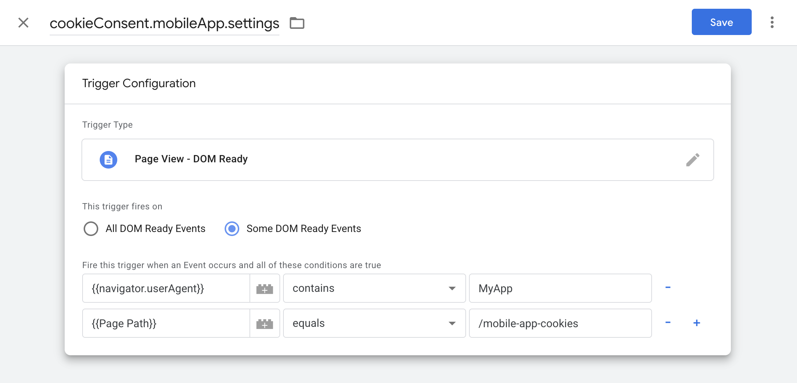
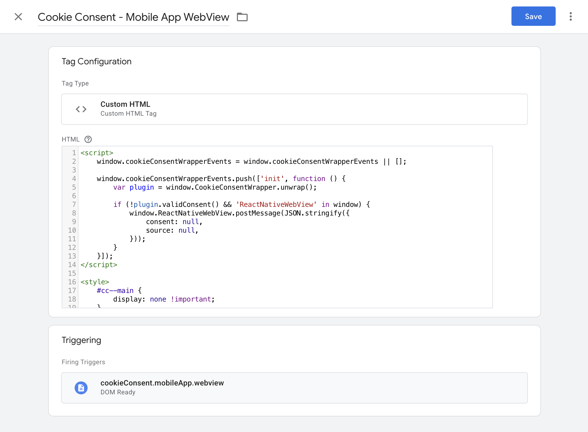
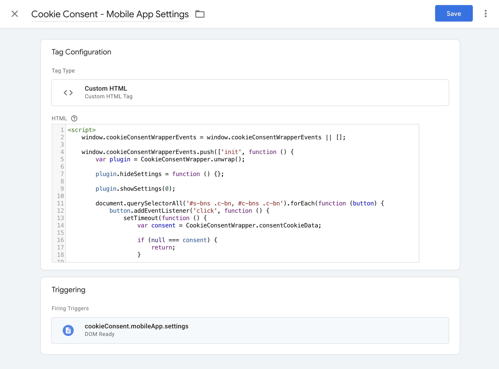
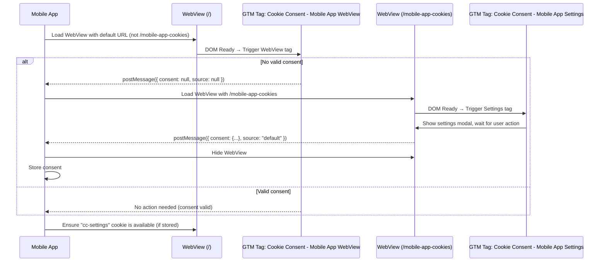
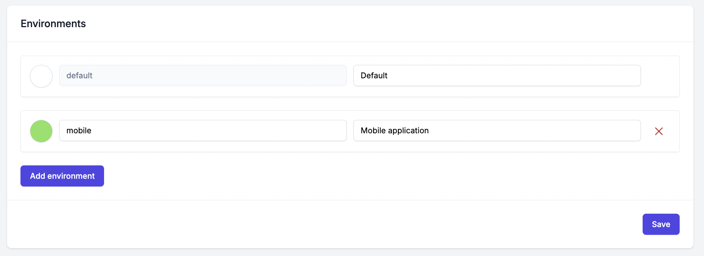
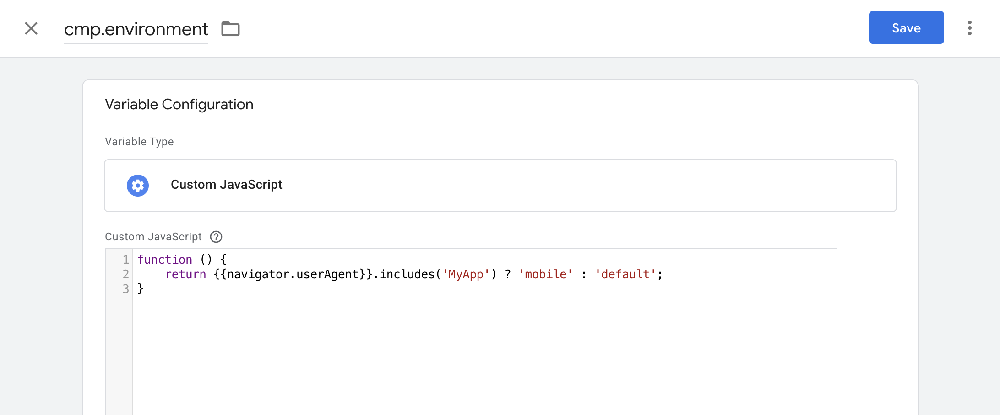
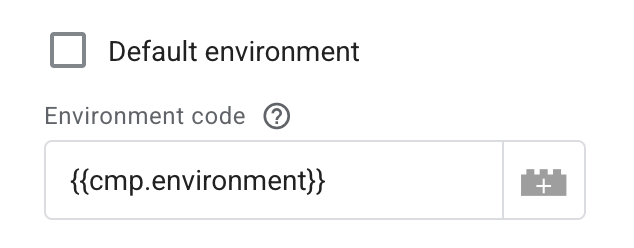

<div align="center" style="text-align: center; margin-bottom: 50px">

<h1 align="center">Integration with Mobile Application</h1>
</div>

This document describes the concept of integrating with a mobile application using a [WebView](https://github.com/react-native-webview/react-native-webview) component in **React Native**.

* [Prerequisites](#prerequisites)
* [Mobile Application Detection](#mobile-application-detection)
* [GTM Trigger Setup](#gtm-trigger-setup)
* [GTM Tag Setup](#gtm-tag-setup)
* [How It Works](#how-it-works)
* [Integration with Consent Management Platform](#integration-with-consent-management-platform)

## Prerequisites

- **Cookie Consent** integrated via GTM
- A dedicated URL available on the website (e.g. `/mobile-app-cookies`) that renders no content. This page is used to display the cookie banner within the mobile application.

## Mobile Application Detection

Detection of the mobile app is necessary in order to determine whether the website is being rendered in a regular browser or within a WebView.
This can be achieved by setting a custom `User-Agent` header from the mobile app, for example: `MyApp/1.0.0`.

In GTM, create a variable named `navigator.userAgent` of type **JavaScript Variable** with the value `navigator.userAgent`.



## GTM Trigger Setup

Two triggers must be defined for proper functionality.

The first trigger named `cookieConsent.mobileApp.webview` should be of type **Page View - DOM Ready** with the following conditions:

1. `{{navigator.userAgent}}` contains `MyApp`
2. `{{Page Path}}` does not equal `/mobile-app-cookies`

This trigger runs only within the mobile app context and on all URLs except `/mobile-app-cookies`.



The second trigger named `cookieConsent.mobileApp.settings` should also be of type **Page View - DOM Ready** with the following conditions:

1. `{{navigator.userAgent}}` contains `MyApp`
2. `{{Page Path}}` equals `/mobile-app-cookies`

This trigger runs only within the mobile app context and exclusively on the `/mobile-app-cookies` URL.



## GTM Tag Setup

Corresponding to the triggers, two GTM tags are required.

The first tag of type "Custom HTML", named `Cookie Consent - Mobile App WebView`, is triggered by `cookieConsent.mobileApp.webview`.

This tag performs the following actions:

- Hides the cookie banner entirely using a `<style>` block so it does not appear within the WebView.
- If no valid consent is detected, a `postMessage` is sent to notify the app.

<details>
<summary>Click to view the code</summary>

```html
<script>
    window.cookieConsentWrapperEvents = window.cookieConsentWrapperEvents || [];

    window.cookieConsentWrapperEvents.push(['init', function () {
        var plugin = window.CookieConsentWrapper.unwrap();

        if (!plugin.validConsent() && 'ReactNativeWebView' in window) {
            window.ReactNativeWebView.postMessage(JSON.stringify({
                consent: null,
                source: null,
            }));
        }
    }]);
</script>

<style>
    #cc--main {
        display: none !important;
    }
</style>
```
</details>



The second tag of type "Custom HTML", named `Cookie Consent - Mobile App Settings`, is triggered by `cookieConsent.mobileApp.settings`.

This tag performs the following actions:

1. Hides the consent modal and close button of the settings modal using a `<style>` block.
2. Immediately opens the settings modal and prevents it from being closed.
3. Once the user interacts (clicks a button), consent is sent to the app using `postMessage`.

<details>
<summary>Click to view the code</summary>

```html
<script>
    window.cookieConsentWrapperEvents = window.cookieConsentWrapperEvents || [];

    window.cookieConsentWrapperEvents.push(['init', function () {
        var plugin = CookieConsentWrapper.unwrap();

        plugin.hideSettings = function () {};

        plugin.showSettings(0);

        document.querySelectorAll('#s-bns .c-bn, #c-bns .c-bn').forEach(function (button) {
            button.addEventListener('click', function () {
                setTimeout(function () {
                    var consent = CookieConsentWrapper.consentCookieData;

                    if (null === consent) {
                        return;
                    }

                    var queryParameters = new URLSearchParams(window.location.search);
                    var message = {
                        consent: consent,
                        source: queryParameters.get('source') || 'default',
                    };

                    if ('ReactNativeWebView' in window) {
                        window.ReactNativeWebView.postMessage(JSON.stringify(message));
                    }
                }, 0);
            });
        });
    }]);
</script>

<style>
    #cc_div #cm, #s-c-bn {
        display: none !important;
    }

    /* Possibly other styles to customize the look ... */
</style>
```
</details>



## How It Works

The mobile application must listen for incoming messages sent via `postMessage` from the GTM tags inside the WebView.
Each message follows this format:

```json5
{
  "source": "default", // string or null
  "consent": {} // object representing the full user consent, equivalent to what is stored in cookies
}
```

When a message is received with a `null` value in the `consent` field, the app should open the WebView with the URL `/mobile-app-cookies` and prompt the user for consent.

When a message with a populated `consent` object is received, the app should hide the WebView and persist the consent.

The mobile app must also ensure that a cookie (default name `cc-settings`) containing the user's consent is always available (if the consent has been stored) in the WebView context, so the banner reflects the current consent state.



## Integration with Consent Management Platform

When integrating with the [Consent Management Platform (CMP)](https://github.com/68publishers/consent-management-platform), it is recommended to distinguish cookie definitions using separate environments.
This is especially useful because the set of cookies used in a mobile application may differ from those on the website.
Doing so ensures that the appropriate cookies are shown in the cookie table within the settings modal for each environment.



It is also advisable to distinguish environments when storing user consents, so the CMP dashboard clearly shows whether consent originated from the website or the mobile application.

To achieve this, a GTM variable named `cmp.environment` of type **Custom JavaScript** can be created:

<details>
<summary>Click to view the code</summary>

```javascript
function () {
    return {{navigator.userAgent}}.includes('MyApp') ? 'mobile' : 'default';
}
```
</details>



This variable should then be used in the field **Integration > CMP API > Environment code**:

 
