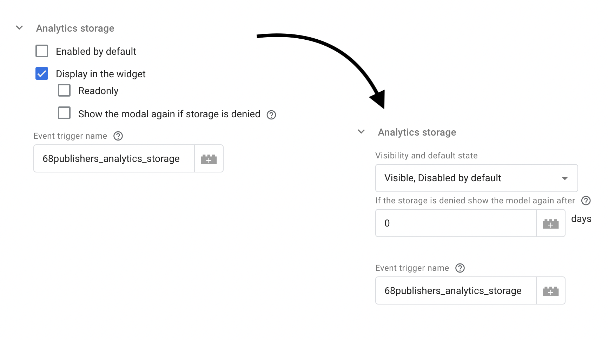

<h1 align="center">Migration from v0.4 to v0.5</h1>

## How does version v0.5 differ

Version `v0.5.0` adds new `ad_user_data` and `ad_personalization` storages for integration with [Google Consent Mode v2](https://developers.google.com/tag-platform/security/guides/consent?consentmode=advanced#upgrade-consent-v2).
For this reason, the configuration for these new storages had to be added to the GTM template.

However, our template has outgrown the limit of 100 fields with this, which is not documented anywhere.
Because of this, we had to modify the configuration of the storages in the template.

The following changes have been made:

- The options `"Enabled by default"`, `"Display in the widget"` and `"Readonly"` have been merged into a single dropdown `"Visibility and default state"`.
- The checkbox `"Show the modal again if storage is denied"` has been removed and only the input `"If the storage is denied show the modal again after X days"` remains. If you want to disable the feature, set the value to `0`.

## How to migrate

Remember, or ideally note somewhere, how you have configured all storages ("Functionality storage", "Security storage" etc.), values for deleted fields will not be preserved when updating the template.

After updating the GTM template, reconfigure storages. The configuration combinations are shown in the table below.

| Previous storage options                                                                                  | New option                                                                                      |
|-----------------------------------------------------------------------------------------------------------|-------------------------------------------------------------------------------------------------|
| Enabled by default = `true` Display in the widget = `true` Readonly = `false`                       | Visibility and default state = `Visible, Enabled by default`                                    |
| Enabled by default = `true` Display in the widget = `true` Readonly = `true`                        | Visibility and default state = `Visible & Readonly, Enabled by default`                         |
| Enabled by default = `false` Display in the widget = `true`                                            | Visibility and default state = `Visible, Disabled by default`                                   |
| Enabled by default = `false` Display in the widget = `false` Synchronize consent with = `<storage>` | Visibility and default state = `Hidden, Synchronized` Synchronize consent with = `<storage>` |
| Enabled by default = `false` Display in the widget = `false` Synchronize consent with = `None`      | Visibility and default state = `Hidden, Disabled always`                                        |

Of course, don't forget to update the field `"Package version"` to `0.5.0` (or higher, if already available).
